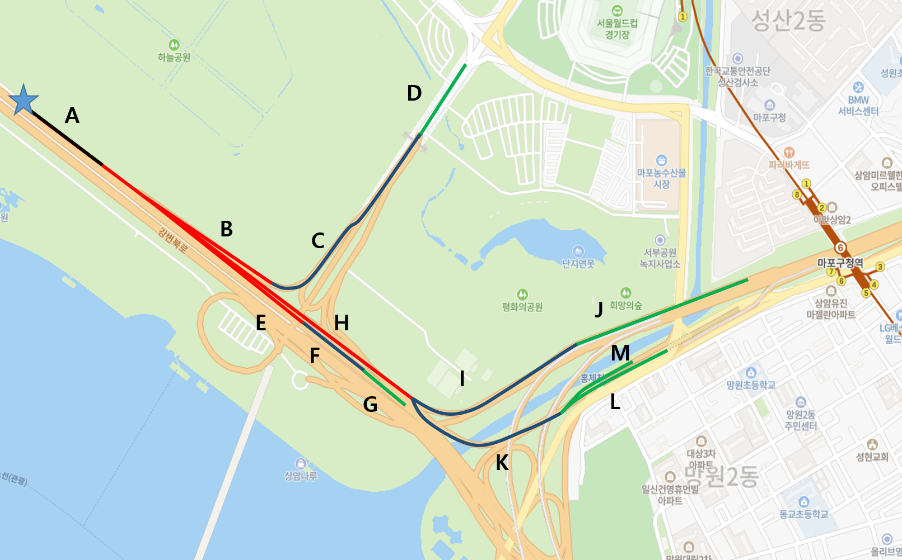

# TE-propagation
Time Delay Estimation of Traffic Congestion Propagation based on Transfer Entropy


## Prerequisite

### RTransferEntropy
When calculating transferentropy, we use R package '[RTransferEntropy](https://github.com/cran/RTransferEntropy)'
```R
install.packages("RTransferEntropy")
```

### rpy2
R package is binded with python using '[rpy2](https://github.com/rpy2/rpy2)'
```python
pip install rpy2
```


## Tutorial code 
`core` contains key functions to estimate time lag with transfer entropy and bootstrap,

```python
get_boot(x, y, lag=None, n_boot=100, plot=True, title=None, raw=None, save=None, curve=None):
'''
    x,y: source and target time series 
    n_boot: the number of bootstrap
    plot: bool, return figure output
    title: figure title
    raw: comparison value (e.g. raw value without normalization)
    save: figure save path
    curve: if true, return fitted curve info
'''
```

function `get_boot` return bootstrap estimation of time lag between two time series with organized plot,


We can estimate the mean and standard deviation of estimate time lag distribution using Bootstrap.
Simulation data and tutorial code is included '[Simulation](https://github.com/yongkyung-oh/TE-propagation/blob/main/Simulation.ipynb)'.


## Real data example
Suggested algorithm can be applied multi-hop path in the traffic network as follow 



In this case there are 5 paths exist:
- path 1
<p align="center"></p>

- path 2
<p align="center"></p>

- path 3
<p align="center"></p>

- path 4
<p align="center"></p>

- path 5
<p align="center"></p>


## Reference
```
Behrendt, S., Dimpfl, T., Peter, F. J., & Zimmermann, D. J. (2019). RTransferEntropy—Quantifying information flow between different time series using effective transfer entropy. SoftwareX, 10, 100265.
```
